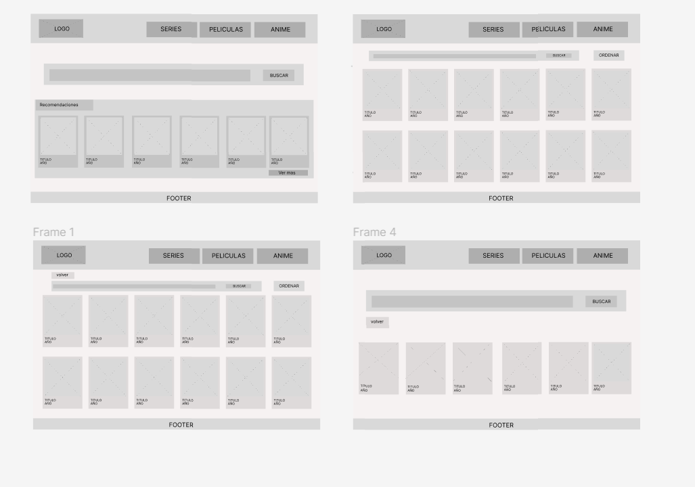
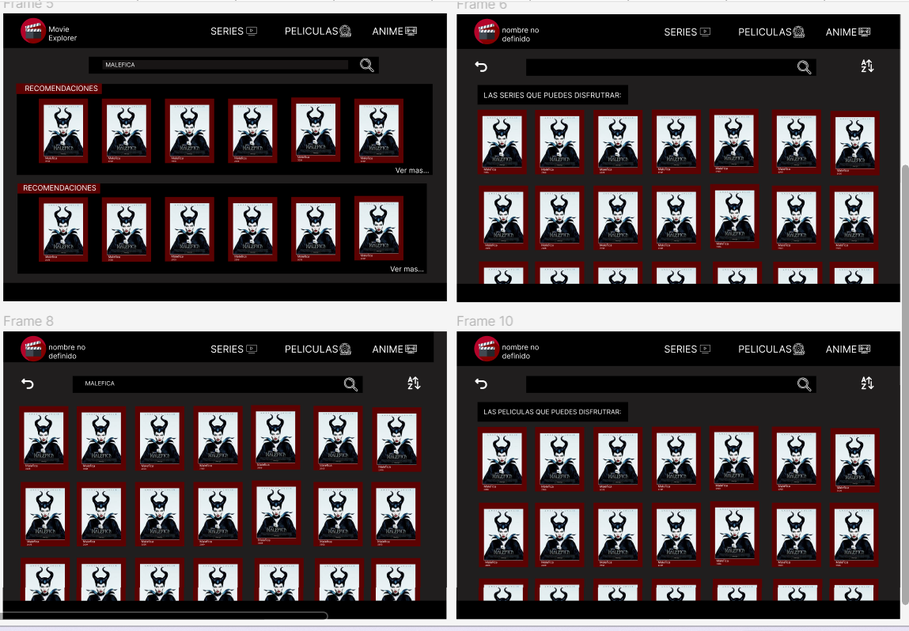

# Movie Challenge con Framework

## Índice

- [Movie Challenge con Framework](#movie-challenge-con-framework)
  - [Índice](#índice)
  - [1.Resumen](#1resumen)
  - [2. Objetivo](#2-objetivo)
  - [3. Prototipos](#3-prototipos)
    - [Prototipo de baja fidelidad](#prototipo-de-baja-fidelidad)
    - [Prototipo de alta fidelidad](#prototipo-de-alta-fidelidad)

---

## 1.Resumen 

Este proyecto esta creado para que el usuario pueda ver que peliculas estan disponibles para poder ver.

## 2. Objetivo

La idea de este proyecto es que el usuario pueba ver y buscar que pelicuas hay disponible, podra buscar por peliculas y tambien filtrando por series.

## 3. Prototipos

### Prototipo de baja fidelidad
Prototipo de baja fidelidad fue presentado a diferentes posibles usuarios para solicitar feedback y realizar cambios para una mejor experiencia al usuario 

### Prototipo de alta fidelidad

El prototipo de alta difelidad fue presentado a diferentes usuarios con el fin derealizas test de usabilidad, el cual dio como resultado ciertos cambios en el.

